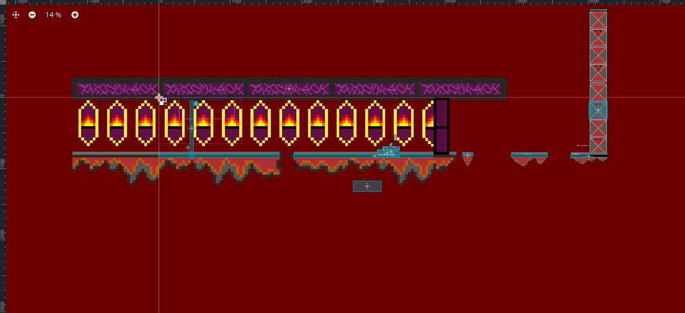
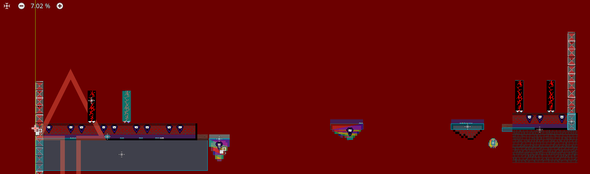
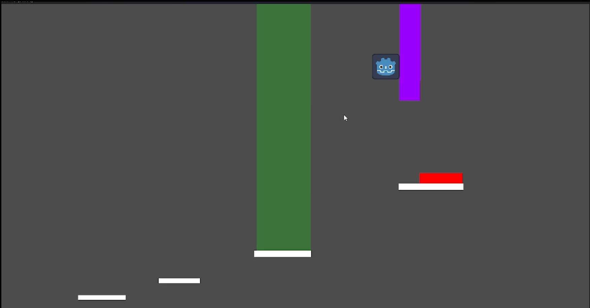
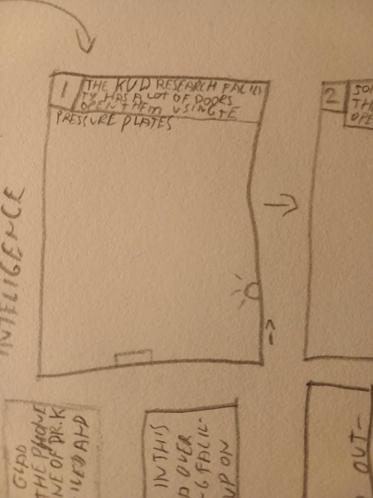
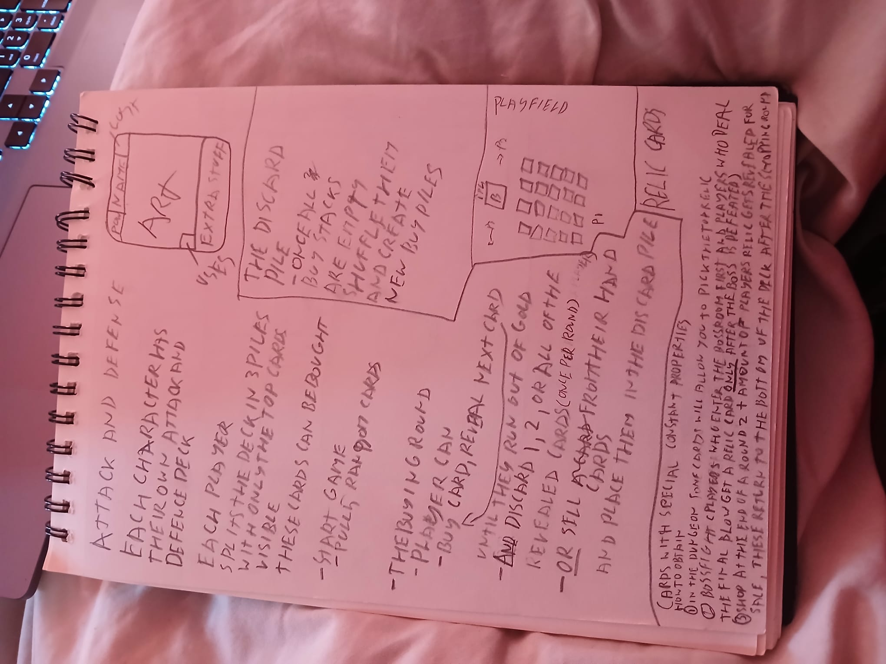
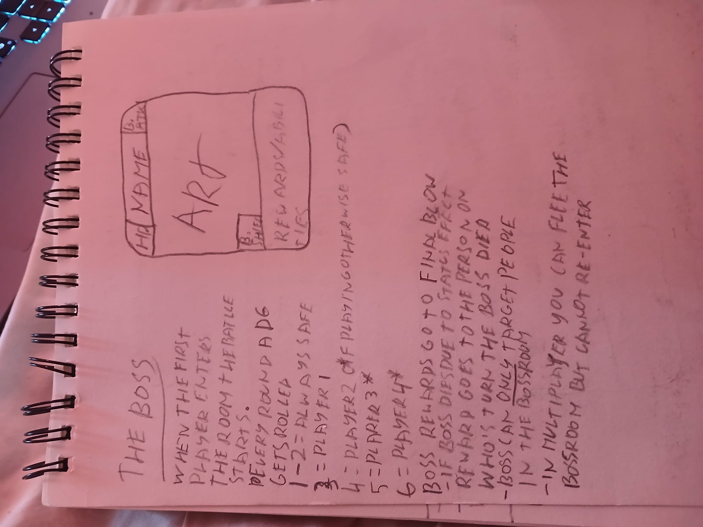

# Owen Kopetzky | portfolio

## Escape from hell
this project was made  as an application for Breda University of Applied sciences.
the game itself is a simple 2d sidescrolling platformer where your goal is to escape hell and ascend to heaven above.
the current project has 2 levels that both take place in hell. 
future plans are in the works to add a boss like mechanic for a third hell level and  also add 3 "earth" and 3 " heaven" levels getting the game up to a total of 9 levels 3 of which will be boss levels.

I also plan on working on music to accompany each level and am thinking about adding a speedrun mode  with a  built in timer.

---

---

## Escape the game
This project was created as another application for Breda University of  Applied sciences.
The  game  itself is once again a 2d platformer but this time it is a puzzle  platformer where your goal is to revert the world back to it's normal non 2d state.
The game currently has a tutorial explaining the main mechanics and 2 actual levels where you use the mechanics that have been thought to press a button and progress to the next level.
planned things for this game are
- [ ] a "life" system
- [ ] enemies
- [ ] music
- [ ] story implementation
- [ ] final boss battle
- [ ] more levels
- [ ] art

---

---

## Dungeon cards
this project has as primary goal to create a  card game that I can play with my friends, the card game itself should create a randomized dungeon by creating a grid of face down "dungeon" cards and then while exploring the dungeon you turn over the cards revealing what is on them, this can be a monster, treasure, a wall or something like an empty space allowing you to safely see past and discover the next card over aswell.
every dungeon has a set starting point and a set end point, after the end point there will be a boss waiting that you have to defeat to continue.
in singleplayer mode your goal is to just survive as many layers as possible while in multiplayer mode you either work together to get as far as possible or try to outlast the other players.
in both single and multiplayer you can choose to not explore the entire dungeon but instead try to go to the boss room in the most direct route possible however this does mean that you'll loose out on the bonsu you get for completing the dungeon. This bonus is important as it mmight give you the edge you need to win the game.

---

---

## Haunted house design
this project is in the very first design stage of my design process.
the goal for this project is to eventually have a sims/blender like environment for designing haunted houses that you can actually walk through after creating them.
for this project to work i have a couple different stages planned

### stage 1. A game
in this stage my goal is to create a game with preset haunted houses that i designed that the player can walk through.
this part needs
- [ ] 3d movement
- [ ] 3d maps
- [ ] lighting
- [ ] moving parts (scare doors and things like that)
- [ ] "realistic" animatronics
- [ ] a menu to choose which house to enter
- [ ] (spatial) sound design

### stage 2. The editor
in this stage the goal is to create a sims like editor that allows players to create their own haunted houses using the rescources already in the game
this part needs
- [ ]  a "freecam"
- [ ]  a way to place walls of custom lengths
- [ ]  a toolbar
- [ ]  an asset library (like the planet coaster series)
- [ ]  a way to save custom builds
- [ ]  a way to share custom builds
- [ ]  an accesible test modus so you can easily switch between editing and walking through your build to get a feeling for the layout
- [ ]  a tutorial

### stage 3. Custom objects
in this stage the goal is to make it possible for people to upload and use their own custom rescources in the game, this part I know the least about at the moment but I think I'm going to need the following.
- [ ]  a way to upload custom textures for walls, floors and ceilings
- [ ]  a way to upload custom animatronics and other moving objects
- [ ]  a way to upload custom sound effects and music
- [ ]  a way to internally catagorize and use all the custom objects
- [ ]  a way to check files for virusses before allowing you to share them with other people
- [ ]  a tutorial on all the different custom things (how to create and uplaod them)